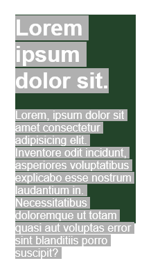
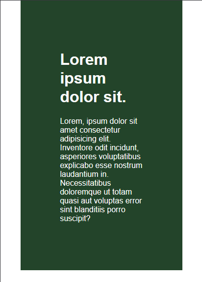
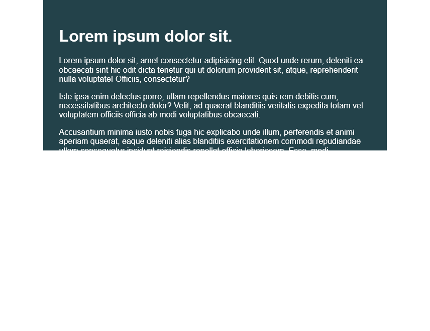
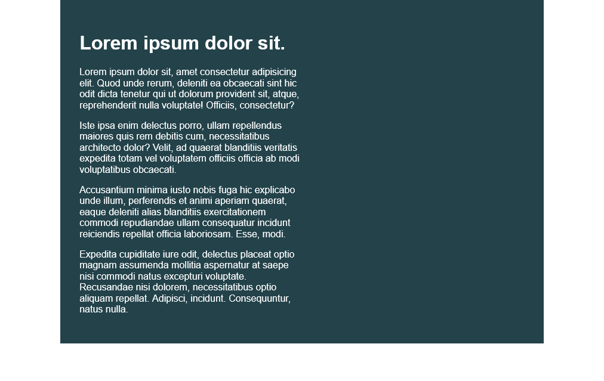

# DAY-1 | Using percentages & avoiding heights 
> ### **NOTE** : _WebPages are always responsive by default its us who ruin the responsiveness by giving them some values._ 

## Lecture 1 : Percentage vs Fixed widths

- we are focusing on width in this lecture.
- we should **use width but in percentage(%)** instead of ~~pixels(px).~~ 

 Output when we give the width in pixels(px). _it's unresponsive._

Output when we give the width in percentage(%). _it's responsive._

## Lecture 2 : Percentage on the child

- child element sets its width according to its parent element.
- if we give width more than 100% to the child element then the child's content will overflow.

Below image is the example of overflow.

## Lecture 3 : Why it's a good idea to avoid heights

There are times when you want ot use height, but for the most part, they cause more issues than they solve.

- In this lesson we will learn about why should we **avoid heights** and **_use padding_** instead.

- we should use `em` and `rem` instead of `px` for giving the size.

- more about [em vs rem](https://youtu.be/_-aDOAMmDHI)
- When we use height the page becomes less responsive & the content inside the parent overflows.

- Even when we give overflow hidden property to parent element the content overflows to right side and user has to scroll horizontally in mobile devices.

- If we give overflow hidden property to the child element, the content will hide and user can't see it even if they scroll page. 

- So it's better to use padding instead of heights & one more thing we should give the padding in `em` or `rem` (16 px = 1 em)

### Below images illustrates the difference between the Outputs of heights and padding.

**_Used height_**

**_Used padding_**

## Challenge 1 :

INSTRUCTIONS

 1) Limit the total width of
    the .intro-conent to about half
    of it's parent

 2) Stop the text from overflowing
    out the bottom at small screen
    widths

 You may modify the HTML if needed

### Solution

