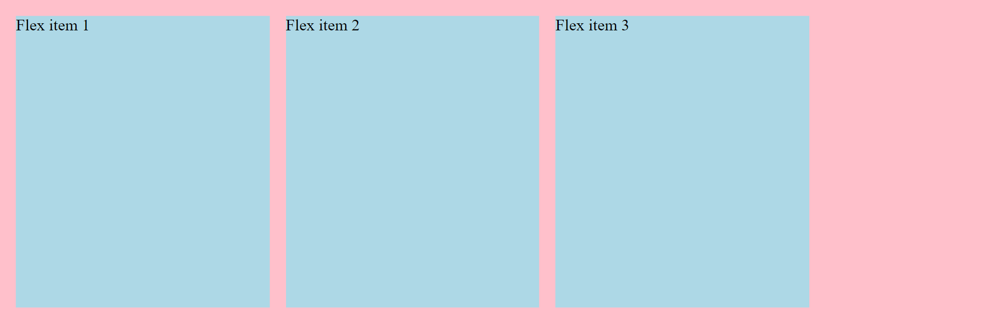

# Tutorial-2 | Flexbox items 

_Flex items are everything that's inside a flexbox_ as soon as we take a container & we apply `display:flex;` 
everything becomes a flex item and we can do a whole bunch of cool flex stuff with it we're controlling them individually
so you can make everything shift from one side to the other but what if you want one thing to act differently that's what
you can do with a bunch of the flexbox properties that are dealing with the individual items and that's what we're gonna be 
exploring right now.

**There's five different properties we'll be looking at and they are following :**

1. [flex-grow](#1-flex-grow)
2. [flex-shrink](#2-flex-shrink)
3. [flex-basis](#3-flex-basis)
4. [flex](#4-flex)
5. [align-self](#5-align-self)
6. [order](#6-order) 


## 1. `flex-grow` :

- **`flex-grow`: This property specifies how much of the remaining space in the flex container should be assigned to the item (the flex grow factor).**

- By default the property is set to i.e. `flex-grow:0;`

    

- **if we set `flex-grow:1;` to an element then that item takes up the empty space left in the flex-container after all the other items take up their space.**
As you can see in the figure the flex-item-1 is larger than the other two flex items as it's taking up the remaining space left after those remaining two take up their space.

    

- The item with higher flex-grow value will grow faster than the other flex-items in the flexbox.

- Growth of items depends on the amount of available space present in the flexbox.

## 2. `flex-shrink` :

- The flex-shrink property specifies how the item will shrink relative to the rest of the flexible items inside the same container.

- By default flex shrink is set to 1. i.e. `flex-shrink:1;`

- if we set the value of `flex-shrink` to zero, it will stop itself from shrinking.

- The higher the value of shrink is the more it shrinks faster. for e.g. if the flex-item1 has higher shrink value than the flex-item2 then it will shrink faster than flex-item2 and become more smaller also.

- Syntax : 

    ```css
    /* <number> values */
    flex-shrink: 2;
    flex-shrink: 0.6;

    /* Global values */
    flex-shrink: inherit;
    flex-shrink: initial;
    flex-shrink: revert;
    flex-shrink: revert-layer;
    flex-shrink: unset;

    ```

- The flex-shrink property is specified as a single `<number>` i.e. **values b/w [0,∞]**

- We can't specify a negative value to the flex-shrink.


## 3. `flex-basis` :

- flex basis specifies how much space does the flex-item want to be taking up if it has the available space.

- flex-basis is set to auto by default i.e. `flex-basis:auto;`

- *if flex-items has not much available space* then the `flex-basis` *would not work* as they'll only take up the space what's specified in flex-basis if the space is available.

### A deep dive into flex-grow, flex-shrink & flex-basis
#### Let's understand all the three concepts clearly with illustrations : 



In the above image you can see there are 3 flex-items which have the following properties : 
```css
.one {
    /* prevents items from growing */
    flex-grow: 0;
    /* makes the items shrinkable */
    flex-shrink: 1;

    flex-basis: 250px;
}

.two {
    flex-grow: 0;
    flex-shrink: 1;

    flex-basis: 250px;
}

.three {
    flex-grow: 0;
    flex-shrink: 1;

    flex-basis: 250px;
}
```
`flex-grow` & `flex-shrink` have the default value whereas the `flex-basis` has a value of `250px`, it means if the amount of space is available for the items to take up then they'll take up the `250px` space as specified in above code. And you can see all the three items are taking up `250px` and there's still some space left in the flexbox container that's because `flex-grow` is set to 0 (default). and if we shrink the flexbox the flex-items will also shrink accordingly (see the below image) as they have flex-shrink set to 1 (default). Even if we don't specify the flex-grow & shrink values the default values will apply anyway.


Now, if we change the flex-grow to **`flex-grow:1;` in the `flex-item1`** then what will happen is that the `flex-item1` will grow and fill the empty space available in the flexbox like given in the image below.But the other two will remain the same.


**if we do the same to the `flex-item2`** then it will grow same as the `flex-item1` and fill the empty space. *Here both the item will grow equally and at same rate.* But still the third will remain the same.

see the below image for clear understanding.


Same thing will happen if we apply the property to `flex-item3`.Here, all the items will grow equally.


**Same thing will work with the shrink property too. They'll shrink according to their shrink value.**

**Conclusion :**

1. flex-grow value = speed of growth of item

2. flex-shrink value = speed of shrink of item.

## 4.  `flex` :
#### Short hand for applying all these properties in a single line :
```css
/* flex : flex-grow | flex-shrink | flex-basis ; */
flex : 0 1 250px;
```

## 5. `align-self` :

- it works same as the `align-items` property except it only aligns itself i.e. the specific item which we want to align.

    
    In the above image `align-items:flex-start;` is given to the flexbox & `align-self:flex-end;` to the `flex-item2` so it goes all the way to end (in the cross axis).

- if we remove the `align-items` property from the flexbox then it will take the default property of `align-items` i.e. `stretch` and will make the other two flex-items stretch to the fill the container vertically or cross-axiswise. *see image below*

    

The last property remaining is `order` let's see it & understand how it works. 

## 6. `order` : 

- The `order` property specifies the order of a flexible item relative to the rest of the flexible items inside the same container.

- `order` takes integer as the value e.g. -1,0,1,2 etc.

- The default value of `order` is 0. it means the item will remain in the order as specified in the HTML file.

Let's understand with example how the order will work. 

```css
.one {
    flex-grow: 1;
    flex-shrink: 1;
    flex-basis: 250px;
}

.two {
    flex-grow: 1;
    flex-shrink: 1;
    flex-basis: 250px;
    align-self: flex-end;
    order: 1;
}

.three {
    flex-grow: 1;
    flex-shrink: 1;
    flex-basis: 250px;
}
```
In the above code you can see the `.two` or flex-item2 has the order of 1. and other have no `order` value so it will take 0 as the default order. 

The items with `order:0;` will remain same as earlier with no changes but the flex-item2 whose order we set to 1 will move to the last as it's the highest order value among all items. See image below. 


**Conclusion : The item with less order will appear before and those with the higher order value will appear after the items with less order.**