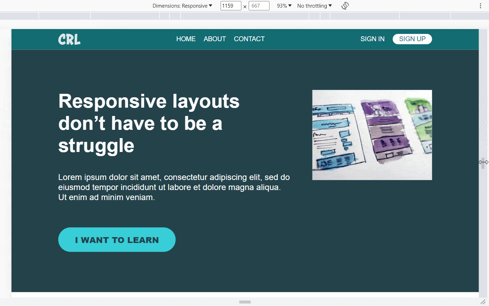
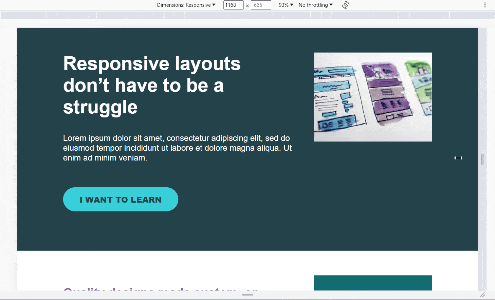

# Day-17 | The meta viewport tag

Todays' lesson is gonna be really short one. We're gonna see about the `viewport meta ` tag. 

You may have seen the code below in your <head> tag : 
```html
<head>
    <meta charset="UTF-8">
    <meta name="viewport" content="width=device-width, initial scale=1.0">
</head>
```

Here the second line which is meta viewport tag is very important in the HTML code as Without a viewport meta tag, mobile devices render pages at typical desktop screen widths and then scale the pages down, making them difficult to read.

Setting the viewport meta tag lets you control the width and scaling of the viewport so that it's sized correctly on all devices.

**Here's what each key-value pair does:**

- `width=device-width` sets the width of the viewport to the width of the device.

- `initial-scale=1` sets the initial zoom level when the user visits the page.

See the illustration given below to understand how the `meta viewport` tag works :

### Without meta viewport :



You can clearly see that the page is not responding to the media query and the whole page is shrinking down instead of the layout change which we applied in the `@media`.

### With meta viewport :



In this case you can see when we shrink our viewport from desktop to mobile screen the properties which we had set in the media query applies to the webpage & layout of the webpage changes as soon as it triggers the `media breakpoint`.